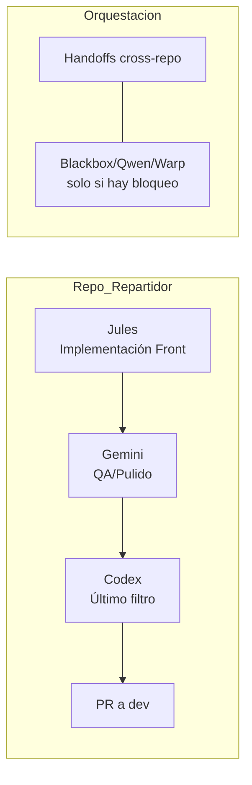

AGENTS-GLOBAL.md — Política de Directorio (Esquema Actualizado)
1) Regla general

Jules, Gemini y Codex no deben operar fuera del directorio del repo donde se ejecutan.

2) Cómo trabajamos multi-repo

Cambios cross-repo → vía handoff (issue con checklist + enlace a PR/artefacto).

Artefactos transferibles: openapi.yaml, SDK-PLAN.md, guías .md, zips con dist del SDK.

Los cambios de código en otros repos se ejecutan mediante handoff. Herramientas adicionales (Copilot/Blackbox/Qwen/Warp) solo si hay bloqueo o se requiere análisis profundo.

3) Ramas y PR

Un PR por repo; dev como target; rama feat/* o docs/*.

Prohibido tocar main y CI fuera del repo abierto.

4) Diagrama (Mermaid)

